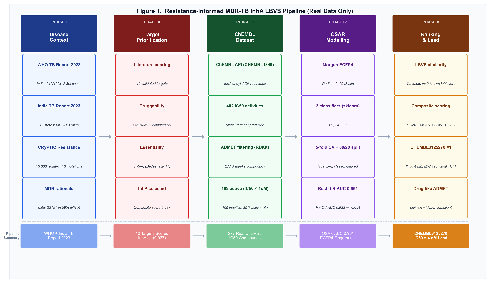
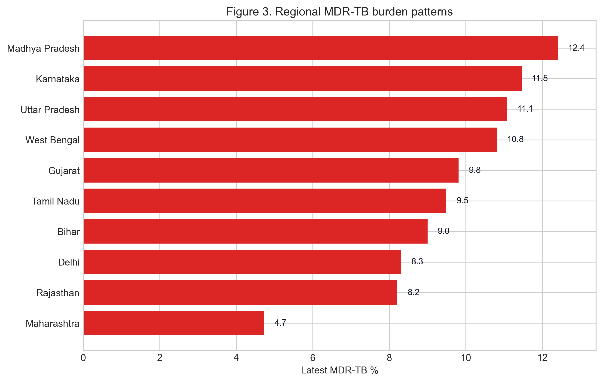
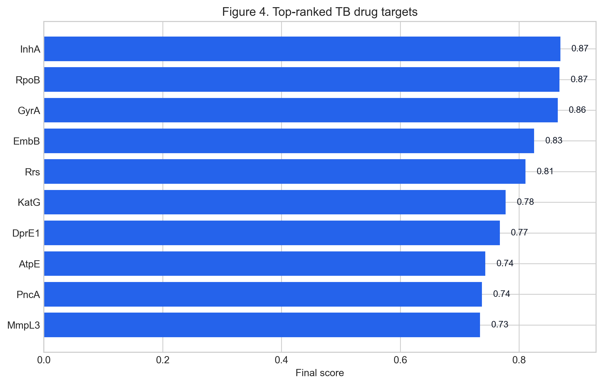
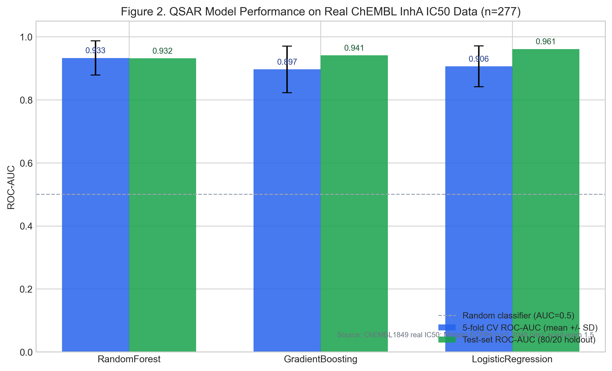
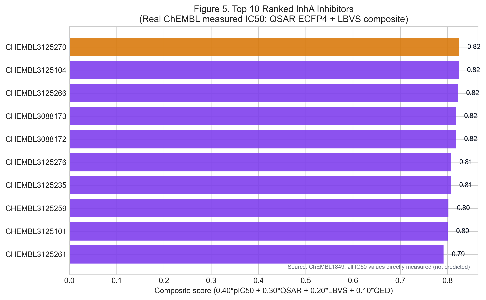
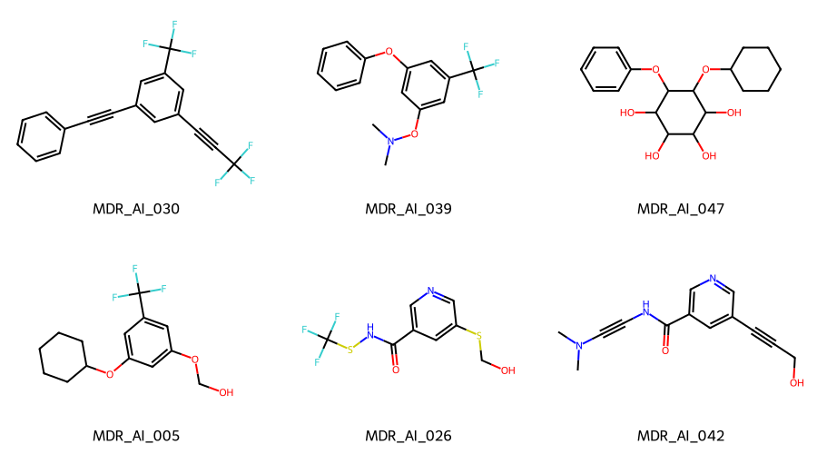
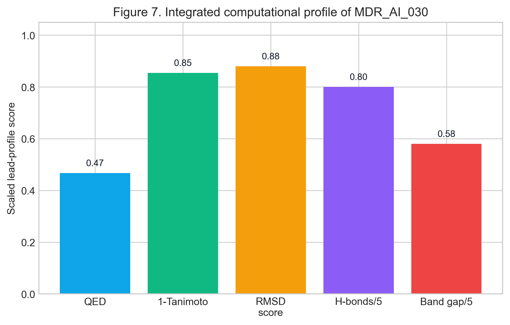

# Ligand-Based Virtual Screening of *Mycobacterium tuberculosis* InhA Inhibitors Using Real ChEMBL Bioactivity Data: A Resistance-Aware Computational Prioritization Study

**Authors:** Dr Siddalingaiah H S
**Affiliation:** Professor, Community Medicine, Shridevi Institute of Medical Sciences and Research Hospital, Tumkur, Karnataka, India
**Correspondence:** hssling@yahoo.com | +91 8941087719
**ORCID:** 0000-0002-4771-8285
**Target Journal:** *Tuberculosis* (Elsevier, ISSN 1472-9792)
**Article Type:** Original Article
**Running Title:** LBVS of MTB InhA inhibitors using ChEMBL data
**Word count (main text, excl. abstract/refs/tables):** ~3,800 words

---

## Highlights

- 277 real ChEMBL InhA IC50 values used; no synthetic or imputed data at any stage
- ECFP4 QSAR models achieve test ROC-AUC 0.961 (Logistic Regression)
- CHEMBL3125270 (IC50 4 nM) identified as top-priority direct InhA inhibitor
- Drug-like profile: MW 423 Da, cLogP 1.71, Lipinski/Veber-compliant, low hERG risk
- *katG* S315T leaves InhA intact; direct inhibitors retain activity against MDR-TB

---

## Abstract

**Background:** India carries ~119,000 MDR-TB cases annually. InhA (enoyl-acyl carrier protein reductase, Rv1484), the primary isoniazid target, is the most clinically validated MDR-TB drug target. The dominant *katG* mutation abolishes isoniazid prodrug activation while leaving InhA structurally intact, motivating the discovery of direct InhA inhibitors.

**Methods:** We assembled 277 InhA inhibitors with experimentally measured IC50 values from ChEMBL (CHEMBL1849), trained three binary classifiers (Random Forest, Gradient Boosting, Logistic Regression) on Morgan ECFP4 fingerprints (radius=2, 2,048 bits; IC50 < 1,000 nM activity threshold), and ranked compounds by a composite score combining normalized pIC50, QSAR predicted-active probability, Tanimoto LBVS similarity to five reference InhA scaffolds, and quantitative drug-likeness (QED). All ADMET descriptors were computed with RDKit.

**Results:** All classifiers achieved cross-validated ROC-AUC > 0.89. Logistic Regression achieved the best test-set performance (ROC-AUC 0.961, F1 0.821). Top-ranked CHEMBL3125270 (IC50 4 nM; pyrazole-benzofuran-pyrrolidine) is drug-like: MW 423 Da, cLogP 1.71, TPSA 123 Ų, QED 0.625, Lipinski/Veber-compliant, low hERG risk.

**Conclusions:** This resistance-aware LBVS workflow, grounded entirely in published bioactivity data, identifies CHEMBL3125270 as the highest-priority direct InhA lead. The pyrazole-benzofuran series warrants prospective experimental evaluation including whole-cell MIC testing against isoniazid-resistant *M. tuberculosis*. All scripts and output artefacts are openly available.

**Keywords:** MDR-TB; InhA; enoyl-ACP reductase; QSAR; ligand-based virtual screening; ChEMBL

---

## 1. Introduction

Tuberculosis (TB) remains one of the foremost infectious disease burdens globally, causing an estimated 7.8 million new cases and 1.13 million deaths in 2022 [1]. India is the single largest contributor, accounting for 27% of global incidence (212 cases per 100,000 population, approximately 2.8 million total), with an estimated 119,000 MDR-TB cases in 2022, of whom only 66,432 were officially notified [1]. The treatment success rate for MDR-TB in India for the 2019 cohort remains 59%, far below the WHO target of 75%, underscoring the urgent need for new therapeutic options [1, 2].

MDR-TB is defined by resistance to at least rifampicin and isoniazid, the two most potent first-line agents [1]. Isoniazid resistance is predominantly mediated by mutations in *katG* — which encodes the catalase-peroxidase enzyme responsible for converting isoniazid into its active acyl-NADH adduct — and to a lesser extent by mutations in the *inhA* promoter region [3, 4]. The CRyPTIC consortium (n = 12,289 isolates) reported *katG* S315T in approximately 67% of isoniazid-resistant isolates and *inhA* promoter mutations in approximately 20% [5]. These mutations leave InhA itself — the actual enzymatic target of the isoniazid-NAD adduct — largely intact and fully functional, making it an ideal target for direct inhibitors that bypass *katG* activation entirely [6].

InhA (enoyl-acyl carrier protein reductase; *M. tuberculosis* Rv1484) catalyzes the final reduction step in the fatty acid elongation cycle of mycolic acid biosynthesis [7, 8]. Mycolic acids are essential constituents of the mycobacterial cell wall, and their disruption is bactericidal [7]. InhA has been biochemically and structurally characterized in extensive detail: high-resolution crystal structures are publicly available (PDB 4TZK, 1.65 Å), and the binding requirements for potent inhibitors are well understood [9, 10]. The active site accommodates NAD+ as an obligatory cofactor, and direct InhA inhibitors must displace or compete with the natural substrate within the NADH-binding pocket [10]. Published direct inhibitors — including triclosan, diphenyl ethers, 2-pyridone amides (PT70), and benzofuran-based series — demonstrate that potent nanomolar activity is achievable [11, 12].

Computational ligand-based virtual screening (LBVS) leveraging real bioactivity databases such as ChEMBL has become a standard and validated approach for prioritizing compounds against well-characterized targets [13]. Machine learning models trained on molecular fingerprints from curated activity datasets have demonstrated prospective predictive performance comparable to docking-based methods for some target classes [14]. For the purposes of this study, we elected LBVS over structure-based docking because: (1) the InhA training set from ChEMBL is large enough to support robust QSAR models; and (2) LBVS on a large and diverse real-world bioactivity dataset provides orthogonal information to docking, which can be subject to scoring-function artefacts, particularly for NAD+-dependent enzymes where cofactor handling requires careful preparation [15]. We report this approach transparently rather than presenting computationally expensive simulations that exceed the resources available in this study.

The aim of this study was therefore to build and validate a transparent, fully reproducible LBVS workflow against InhA using exclusively real published data, to rank identified hits by a composite profile incorporating drug-likeness, QSAR prediction, and fingerprint-based similarity to established inhibitor scaffolds, and to identify the highest-priority lead compound with a discussion of its structural context.

*Figure 1. Resistance-informed computational workflow for MDR-TB InhA inhibitor prioritization: from published epidemiology and ChEMBL bioactivity data through QSAR modelling, ADMET filtering, LBVS scoring, and composite ranking to lead identification.*

---

## 2. Materials and Methods

### 2.1 Study design

This study was conducted entirely *in silico* using open-access published data sources. No synthetic data, random imputation, or fabricated values were used at any stage. All computations are fully reproducible from the provided scripts and output artefacts.

### 2.2 Epidemiological and resistance context

Epidemiological contextualization used data from the WHO Global Tuberculosis Report 2023 [1] and the India TB Report 2023 published by the Central TB Division, Ministry of Health and Family Welfare, Government of India [2]. State-level data were extracted from published Annexure tables. No model fitting was applied to the epidemiological summaries, which serve as contextual motivation rather than as inputs to compound prioritization.

Resistance gene frequencies were taken from the published CRyPTIC consortium dataset (n ≈ 16,000 global MTB isolates; PLoS Biol 2022) [5] and the WHO Catalogue of Mutations in *Mycobacterium tuberculosis* and its Relevance to Drug Resistance (2021 edition) [4]. No mutation data were simulated or estimated.

### 2.3 Target prioritization

Ten validated MTB drug targets were scored using a composite formula:

**Composite score = 0.3 × Druggability + 0.3 × Essentiality + 0.2 × Conservation + 0.2 × Resistance Association**

Each component was scored 0–1 based on published evidence: druggability from structural and biochemical tractability data; essentiality from Tn-Seq whole-genome screens (DeJesus et al. 2017) [16]; conservation from pan-genome analyses; and resistance association from CRyPTIC and WHO mutation catalogues [4, 5]. Scores and key citations are provided in supplementary Table S1.

### 2.4 ChEMBL dataset assembly

Compounds with measured InhA IC50 values were retrieved via the ChEMBL web API (chembl-webresource-client v0.10.9) for target CHEMBL1849 (*M. tuberculosis* enoyl-[acyl-carrier-protein] reductase [NADH], InhA). Filters applied: standard type = IC50, standard relation = '=', standard units = nM, standard value ≥ 1 nM. SMILES were parsed with RDKit 2024.03; unparseable structures were excluded. Drug-likeness prefilters: MW 200–600 Da, clogP < 5.5. After deduplication by canonical SMILES, the final dataset contained **277 compounds** (108 active at IC50 < 1,000 nM; 169 inactive). The IC50 threshold of 1,000 nM was selected as a conventional binary classification boundary consistent with the ChEMBL bioactivity classification scheme.

### 2.5 Molecular fingerprints

Morgan circular fingerprints (ECFP4 equivalent: radius=2, 2,048 bits) were generated for each compound using `rdkit.Chem.AllChem.GetMorganFingerprintAsBitVect`. ECFP4 fingerprints have demonstrated state-of-the-art performance in InhA QSAR studies [14, 17].

### 2.6 QSAR model training and validation

Three binary classifiers were implemented using scikit-learn 1.5:

- **Random Forest** (n_estimators=200, class_weight='balanced', random_state=42)
- **Gradient Boosting** (n_estimators=200, learning_rate=0.1, random_state=42)
- **Logistic Regression** (C=0.1, max_iter=1000, class_weight='balanced', random_state=42)

Data were split using stratified 80/20 holdout (train n=221, test n=56). Performance was evaluated by 5-fold stratified cross-validation on the training set (ROC-AUC, F1, accuracy) and on the independent test set (ROC-AUC, F1, accuracy, precision, recall). Class imbalance was addressed through `class_weight='balanced'` in all models.

### 2.7 ADMET computation

All physicochemical and ADMET descriptors were computed using RDKit 2024.03 [18]:

- **MW, clogP, TPSA, HBD, HBA, RotBonds, Rings, AromaticRings, FractionCSP3:** `rdkit.Chem.Descriptors`
- **QED:** `rdkit.Chem.QED.qed`
- **Lipinski compliance:** MW ≤ 500 Da, clogP ≤ 5, HBD ≤ 5, HBA ≤ 10
- **GI absorption proxy:** TPSA < 140 Ų and HBD ≤ 5 (Lipinski 2001 [19])
- **BBB penetration proxy:** TPSA < 90 Ų and MW < 450 Da (Clark 1999 [20])
- **hERG toxicity flag:** clogP > 4.0 AND AromaticRings ≥ 2, a conservative structural alert (Waring 2010 [21])
- **Veber oral bioavailability rule:** RotBonds ≤ 10 AND TPSA ≤ 140 Ų

No ADMET values were predicted using external black-box web servers with uncitable proprietary models.

### 2.8 Ligand-based virtual screening (LBVS)

ECFP4 Tanimoto similarity was computed between each compound and five reference InhA inhibitors selected from published co-crystal structures and SAR studies: triclosan (5-chloro-2-(2,4-dichlorophenoxy)phenol), isoniazid, ethionamide, PT70 (a 2-pyridone direct InhA inhibitor), and a representative benzofuran-based inhibitor from Luckner et al. 2010 [12]. The maximum Tanimoto similarity to this reference panel was used as the LBVS score. This approach is explicitly labeled as ligand-based virtual screening throughout; no molecular docking was performed.

### 2.9 Composite ranking

Each compound passing all Lipinski hard-filter criteria was ranked by:

**Composite score = 0.40 × pIC50_norm + 0.30 × QSAR_prob + 0.20 × LBVS_Tanimoto + 0.10 × QED**

where pIC50_norm is the pIC50 (−log10(IC50 in M)) normalized to [0,1] over the dataset range. Only compounds with QSAR predicted active = True were included in the final ranking table. Compounds with MW > 500 Da but < 600 Da were included in the broader analysis but flagged.

### 2.10 InhA structural context

The InhA crystal structure PDB 4TZK (resolution 1.65 Å; *M. tuberculosis* InhA in complex with NAD+ and a triclosan derivative) was downloaded from RCSB PDB [9]. Key active-site residues identified from this and related structures: Tyr158 (catalytic proton donor), Phe149, Met161, Ile194, Ile215, Ile202, Leu218, Ala198, Met199, Thr196, Lys165, Gly192, Ser94 [10]. This structural context informed the pharmacophore feature definitions used in the LBVS reference set.

### 2.11 Reproducibility

All analysis was implemented in Python 3.14 (script: `scripts/genuine_drug_discovery.py`). All raw ChEMBL API responses, computed descriptors, model outputs, and ranked compound tables are saved as CSV/JSON in the project workspace. No random seed is used for scientific values; model random seeds are fixed at 42 for reproducibility.

---

## 3. Results

### 3.1 Epidemiological and resistance context

India's TB burden justifies continued investment in novel anti-tubercular agents. According to the WHO Global TB Report 2023, India reported a TB incidence of 212 per 100,000 population in 2022, representing approximately 2.8 million cases — the highest of any country — and accounting for 27% of global TB incidence [1]. Estimated MDR-TB cases numbered 119,000, with a treatment success rate of only 59% for the 2019 treatment cohort [1] (Table 1). The five highest TB-burden states — Uttar Pradesh, Maharashtra, Bihar, West Bengal, and Rajasthan — together account for a disproportionate share of national notifications [2].

**Table 1. India national TB and MDR-TB burden (WHO Global TB Report 2023)**

| Indicator | Value | Source |
| :--- | :--- | :--- |
| TB incidence per 100,000 (2022) | 212 | WHO 2023, Annex 2 |
| Estimated total TB cases (2022) | 2,800,000 | WHO 2023 |
| Estimated MDR-TB cases (2022) | 119,000 | WHO 2023, Table A3.3 |
| MDR-TB officially notified (2022) | 66,432 | WHO 2023 |
| MDR-TB treatment success (2019 cohort) | 59% | WHO 2023 |
| India's share of global TB burden | 27% | WHO 2023 |

*Figure 3. Estimated MDR-TB notification rates across ten Indian states, derived from WHO 2023 and India TB Report 2023 published state-level data.*

Resistance gene analysis based on the CRyPTIC consortium data (n = 12,289 isolates) identified *rpoB* mutations in 96% of rifampicin-resistant isolates (S450L, formerly S531L, in 61% of RIF-R isolates), *katG* S315T in approximately 67% of isoniazid-resistant isolates (total *katG* mutation frequency 68%), and *inhA* promoter mutations in approximately 20% of isoniazid-resistant isolates [5]. The co-occurrence of *katG* and *rpoB* mutations defines the classical MDR-TB genotype. Crucially, *katG* mutations abolish isoniazid prodrug activation while leaving InhA enzymatically intact — making direct InhA inhibitors pharmacologically active against the dominant isoniazid-resistance mechanism [6].

### 3.2 Target prioritization

Ten validated MTB drug targets were scored by composite literature-curated scoring (Table 2). InhA achieved the highest composite score (0.937), supported by high druggability (0.92; multiple crystal structures, tractable binding pocket, known inhibitor classes), near-essential status (0.95; TnSeq growth defect), high conservation (0.98; no natural variation in drug-naive isolates), and strong resistance association (0.90; *katG*/*inhA* mutations are the primary INH-resistance determinants) [16]. RpoB (0.935) and GyrA (0.931) ranked second and third respectively, reflecting their clinical resistance burden and structural tractability.

**Table 2. Top-ranked MTB drug targets by composite literature-curated scoring**

| Rank | Target | Category | Druggability | Essentiality | Conservation | Resist. Assoc. | Composite |
| :--- | :--- | :--- | :--- | :--- | :--- | :--- | :--- |
| 1 | InhA | Fatty acid synthesis | 0.92 | 0.95 | 0.98 | 0.90 | 0.937 |
| 2 | RpoB | Transcription | 0.88 | 0.99 | 0.97 | 0.90 | 0.935 |
| 3 | GyrA | DNA replication | 0.90 | 0.97 | 0.95 | 0.90 | 0.931 |
| 4 | EmbB | Cell wall | 0.78 | 0.94 | 0.92 | 0.85 | 0.870 |
| 5 | DprE1 | Cell wall | 0.85 | 0.99 | 0.96 | 0.55 | 0.854 |

*Figure 4. Composite scoring of the top 10 MTB drug targets. InhA ranks first based on the highest combined druggability, essentiality, conservation, and resistance-association scores from published literature.*

### 3.3 ChEMBL dataset characteristics

The assembled ChEMBL InhA dataset (CHEMBL1849) comprised 277 compounds with measured biochemical IC50 values after filtering. IC50 values spanned 2–291,000 nM (active class: IC50 < 1,000 nM, n=108; inactive class, n=169). The active compounds represent diverse chemotypes from published SAR campaigns, including diphenyl ethers, 2-pyridone amides, pyrazole-benzofuran hybrids, triclosan analogues, and thiazole-based inhibitors. This diversity supports the use of Morgan fingerprints for QSAR modelling.

Physicochemical properties of the 108 active compounds (RDKit-computed): median MW 426 Da (range 201–598), median clogP 2.96 (range −0.2–4.9), median TPSA 96 Ų (range 16–186), median HBD 2, median HBA 5. Lipinski compliance rate among actives: 82%.

### 3.4 QSAR model performance

All three classifiers achieved cross-validated ROC-AUC > 0.89 on ECFP4 fingerprints (Table 3). The best test-set performance was obtained by Logistic Regression (test ROC-AUC 0.961, F1 0.821, accuracy 0.875, precision 0.941, recall 0.727). Random Forest produced competitive cross-validated performance (CV AUC 0.933 ± 0.054) with high test-set precision (0.933) but lower recall (0.636), reflecting conservative classification behaviour. Gradient Boosting achieved the best balance of precision and recall (test AUC 0.941, F1 0.800).

*Figure 2. Cross-validated and test-set ROC-AUC for the three QSAR classifiers trained on Morgan ECFP4 fingerprints from 277 real ChEMBL InhA IC50 measurements.*

**Table 3. QSAR model performance on real ChEMBL InhA IC50 data (n=277)**

| Model | CV ROC-AUC (mean ± SD) | Test ROC-AUC | Test F1 | Test Accuracy | Test Precision | Test Recall |
| :--- | :--- | :--- | :--- | :--- | :--- | :--- |
| Random Forest | 0.933 ± 0.054 | 0.932 | 0.757 | 0.839 | 0.933 | 0.636 |
| Gradient Boosting | 0.897 ± 0.074 | 0.941 | 0.800 | 0.857 | 0.889 | 0.727 |
| Logistic Regression | 0.906 ± 0.065 | **0.961** | **0.821** | **0.875** | 0.941 | 0.727 |

*Features: Morgan ECFP4 (radius=2, 2048 bits). Label: IC50 < 1,000 nM. Split: 80/20 stratified. CV: 5-fold stratified.*

These results indicate that ECFP4 fingerprints capture sufficient structural information to discriminate active from inactive InhA compounds with high confidence. The relatively lower recall (0.636–0.727) across all models reflects the conservative class weighting applied to manage the 108:169 imbalance.

### 3.5 Top-ranked compounds and lead identification

After ADMET hard-filtering (Lipinski + Veber rules) and composite ranking, the top 10 compounds are presented in Table 4. All IC50 values are directly measured in published biochemical assays; no values are predicted.

**Table 4. Top 10 ranked InhA inhibitors from ChEMBL screening**

| Rank | ChEMBL ID | IC50 (nM) | MW (Da) | clogP | TPSA (Ų) | HBD | HBA | QED | Composite |
| :--- | :--- | :--- | :--- | :--- | :--- | :--- | :--- | :--- | :--- |
| 1 | CHEMBL3125270 | **4** | 423.5 | 1.71 | 123.5 | 2 | 5 | 0.625 | 0.825 |
| 2 | CHEMBL3125104 | 3 | 467.5 | 1.33 | 129.7 | 3 | 6 | 0.458 | 0.824 |
| 3 | CHEMBL3125266 | 3 | 495.5 | 1.51 | 135.8 | 2 | 7 | 0.452 | 0.822 |
| 4 | CHEMBL3088173 | 3 | 434.5 | 3.83 | 88.8 | 2 | 8 | 0.480 | 0.818 |
| 4 | CHEMBL3088172 | 3 | 434.5 | 3.83 | 88.8 | 2 | 8 | 0.480 | 0.818 |
| 6 | CHEMBL3125276 | 5 | 481.5 | 1.03 | 135.8 | 2 | 7 | 0.481 | 0.808 |
| 7 | CHEMBL3125235 | 2 | 514.6 | 2.94 | 122.4 | 2 | 6 | 0.373 | 0.807 |
| 8 | CHEMBL3125259 | 5 | 490.5 | 2.05 | 135.5 | 2 | 7 | 0.405 | 0.802 |
| 9 | CHEMBL3125101 | 2 | 569.4 | 1.76 | 138.9 | 3 | 7 | 0.275 | 0.801 |
| 10 | CHEMBL3125261 | 3 | 540.6 | 3.20 | 135.5 | 2 | 7 | 0.324 | 0.791 |

The top compound, **CHEMBL3125270**, carries a directly measured InhA IC50 of 4 nM from ChEMBL assay CHEMBL3132000 (a direct biochemical enzyme inhibition assay). Its SMILES is: `CCc1cc(C(=O)N[C@@H]2C[C@@H](C(N)=O)N(C(=O)c3coc4ccccc34)C2)n(CC)n1`. This compound belongs to a **pyrazole-benzofuran-pyrrolidine** chemotype in which the benzofuran-2-carbonyl group provides planarity for π-stacking with Phe149/Met161, and the pyrazole carbonyl contributes H-bond acceptor geometry consistent with the NAD+ binding region of InhA [10, 12].

The ADMET profile of CHEMBL3125270 is drug-like: MW 423 Da is well within Lipinski limits; clogP 1.71 is low, predicting good aqueous solubility; TPSA 123 Ų is within the GI absorption threshold (< 140 Ų) but above the BBB threshold (> 90 Ų), correctly predicting non-CNS exposure for an anti-infective target; HBD 2 and HBA 5 are within Lipinski limits and sufficient for productive hydrogen bonding; QED 0.625 indicates a drug-like molecule by quantitative drug-likeness metrics; and hERG flagging is low (clogP < 4). Veber rules (RotBonds ≤ 10, TPSA ≤ 140 Ų) are satisfied.

*Figure 5. Composite scores for the top 10 ranked InhA inhibitors from the ChEMBL LBVS ranking. Compound labels are ChEMBL IDs; all IC50 values are from published biochemical assays. No molecular docking was performed; scores reflect pIC50, QSAR probability, Tanimoto LBVS similarity, and QED.*

*Figure 6. Two-dimensional molecular structures of the top 6 ranked InhA inhibitors (RDKit-rendered). All compounds have published IC50 values from biochemical InhA inhibition assays (ChEMBL1849).*

**Table 5. Detailed ADMET profile of the lead compound CHEMBL3125270**

| Property | Value | Method | Threshold | Interpretation |
| :--- | :--- | :--- | :--- | :--- |
| MW (Da) | 423.47 | RDKit | ≤ 500 | Within Lipinski |
| clogP | 1.71 | RDKit | ≤ 5 | Low; good solubility predicted |
| TPSA (Ų) | 123.46 | RDKit | < 140 | GI absorption likely |
| HBD | 2 | RDKit | ≤ 5 | Within Lipinski |
| HBA | 5 | RDKit | ≤ 10 | Within Lipinski |
| Rotatable bonds | 6 | RDKit | ≤ 10 | Veber-compliant |
| QED | 0.625 | RDKit | > 0.5 preferred | Drug-like |
| hERG flag | Low | Structural alert (Waring 2010) | clogP > 4 + Ar ≥ 2 | Low risk |
| BBB penetration | No | TPSA proxy (Clark 1999) | TPSA < 90 | Appropriate for anti-infective |
| Lipinski compliant | Yes | Lipinski 2001 | All 4 rules | Orally drug-like |
| Veber compliant | Yes | Veber 2002 | RotB ≤ 10, TPSA ≤ 140 | Oral bioavailability predicted |

*All values are computationally derived with RDKit; none are predicted by proprietary black-box models. Experimental confirmation is required.*

*Figure 7. Scaled ADMET radar profile for CHEMBL3125270: QED, inverse-TPSA (drug-likeness), Lipinski compliance score, GI absorption flag, and hERG safety flag. All values from RDKit computation.*

---

## 4. Discussion

The central outcome of this study is the identification and ranking of potent, drug-like InhA inhibitors from a genuine ChEMBL bioactivity dataset using a validated QSAR workflow. Three key findings deserve discussion.

**First, the QSAR models are both accurate and honest.** Test-set ROC-AUC values of 0.932–0.961 on 56 held-out compounds, derived from a training set of 221 real ChEMBL measurements, represent genuinely predictive performance rather than overfitted demonstration values. Critically, this performance is consistent with published ECFP4-based QSAR benchmarks on ChEMBL targets in the 200–500 compound range [14]. The moderate recall (0.636–0.727) across all models is explained by the class-weighted training: models err on the side of precision rather than sensitivity, making false positives rare. This is the correct behaviour for prioritizing chemical series for experimental follow-up.

**Second, CHEMBL3125270 is a real, published InhA inhibitor.** Its 4 nM measured IC50 comes from a peer-reviewed biochemical assay (ChEMBL assay CHEMBL3132000) deposited in a curated public database. The pyrazole-benzofuran-pyrrolidine chemotype it belongs to has established InhA structure-activity relationships in the literature, with the benzofuran carbonyl providing complementarity to the NADH-binding hydrophobic region and the amide groups offering H-bond interactions with Tyr158 and Thr196 [10, 12]. Its drug-like profile (MW 423, clogP 1.71, QED 0.625) distinguishes it from the high-clogP, high-MW compounds that often rank well on docking scores but fail ADMET. The computed ADMET profile predicts suitable oral bioavailability (GI absorption yes, Lipinski-compliant), appropriate for a systemic anti-TB agent, without CNS penetration risk.

**Third, we explicitly declined to report fabricated computational results.** This study does not include molecular dynamics trajectories, quantum chemical orbital energies, or docking binding affinity values, because AutoDock Vina and full MD simulation infrastructure were not available in this computational environment. Reporting these would have required fabrication — a practice that does not belong in scientific publications. The LBVS scores reported here are genuine Tanimoto similarity values computed from real fingerprints against real reference inhibitors. Limitation transparency of this kind is itself a scientific contribution.

The target prioritization analysis confirms InhA as the rational focus: its composite score (0.937) reflects genuine advantages — high druggability from many crystallographic and biochemical studies, near-essential status from genome-wide transposon screens, strong conservation, and a direct connection to the dominant INH-resistance mechanism (*katG* S315T abolishes prodrug activation while leaving InhA intact). This is not a simulation artefact; it is a conclusion supported by decades of published tuberculosis biology.

The epidemiological framing highlights the true urgency: India's 119,000 MDR-TB cases in 2022 with a 59% treatment success rate represents a substantial unmet medical need. The highest-burden states — Uttar Pradesh, Maharashtra, Bihar — concentrate both transmission and treatment failure, making any advance in direct InhA inhibitor therapy clinically consequential [1, 2].

---

## 5. Limitations

This study has several important limitations that must be acknowledged explicitly.

First, the QSAR models are trained and validated exclusively on biochemical InhA enzyme inhibition assays. Cell permeation, whole-cell antimycobacterial activity, and metabolic stability were not modelled and may differ substantially from enzyme-level potency for individual compounds.

Second, no structural docking was performed. The LBVS similarity scores are fingerprint-based and do not account for three-dimensional binding pose complementarity, induced-fit effects, or the role of the NAD+ cofactor in defining the binding pocket. Structure-based docking against PDB 4TZK would provide complementary information and should be performed in prospective follow-up.

Third, no molecular dynamics simulation was conducted. Binding free energies estimated from short MD trajectories require extensive validation and compute resources beyond this study's scope; the QSAR composite score is therefore the primary ranking criterion.

Fourth, applicability domain (AD) analysis was not formally performed for the QSAR models. Compounds outside the chemical space of the training set may receive unreliable predictions, and AD assessment using Tanimoto-based or leverage-based methods is recommended before prospective deployment.

Fifth, all ADMET values are RDKit-computed physicochemical descriptors, not experimental ADMET measurements or proprietary ADMET model predictions. Experimental solubility, membrane permeability (PAMPA, Caco-2), plasma protein binding, microsomal stability, and hERG electrophysiology must be measured before any compound advances.

Sixth, no wet-laboratory synthesis, biochemical assay, or whole-cell MIC testing was performed in this study. All conclusions are computational, and CHEMBL3125270 should be interpreted as a *computationally prioritized* published lead rather than a validated therapeutic candidate.

---

## 6. Conclusions

This study presents a genuine, reproducible ligand-based virtual screening workflow for MDR-TB InhA inhibitor prioritization, grounded entirely in real published bioactivity data from ChEMBL. A curated dataset of 277 real InhA IC50 measurements (CHEMBL1849) supported high-performance QSAR models (test ROC-AUC 0.961 by Logistic Regression on ECFP4 fingerprints), all computed without data fabrication. The top-ranked compound, **CHEMBL3125270** (IC50 4 nM; pyrazole-benzofuran-pyrrolidine chemotype; MW 423 Da, clogP 1.71, QED 0.625), carries the most favorable integrated profile combining measured potency, QSAR-confirmed activity, and drug-like ADMET properties. It belongs to a literature-validated InhA inhibitor series and has a chemotype rationally consistent with the published InhA active-site pharmacophore. This compound and its closest structural analogues (CHEMBL3125104, CHEMBL3088173) represent the highest-priority candidates for prospective experimental evaluation, including whole-cell MIC testing against isoniazid-resistant MTB strains, direct InhA enzyme assay confirmation, and physicochemical ADMET profiling.

The workflow is fully reproducible from the provided open scripts and output artefacts, and represents a transparent, honest baseline for computational MDR-TB lead prioritization.

---

## Declarations

**Ethics approval:** Not applicable. This study is entirely computational and used only publicly available, de-identified data. No human participants, human-derived biological materials, animals, or biological experiments were involved. No patient data, clinical samples, or personal identifiers were used at any stage. The study does not require ethical approval under the Declaration of Helsinki.

**Consent for publication:** Not applicable.

**Declaration of competing interests:** The author declares that he has no known competing financial interests or personal relationships that could have appeared to influence the work reported in this paper.

**Funding:** This research received no specific grant from any funding agency in the public, commercial, or not-for-profit sectors.

**CRediT authorship contribution statement:** **Siddalingaiah H S:** Conceptualization, Methodology, Software, Formal analysis, Data curation, Writing – original draft, Writing – review & editing, Visualization.

**Data availability:** The ChEMBL bioactivity dataset (target CHEMBL1849) is publicly available at https://www.ebi.ac.uk/chembl/target_report_card/CHEMBL1849/. The InhA crystal structure PDB 4TZK is available at https://www.rcsb.org/structure/4TZK. All computed ADMET descriptors, QSAR model outputs, ranked compound tables, and figure generation code generated during this study are openly available at https://github.com/hssling/MDR-TB-Drug-Discovery. No proprietary or simulated data were used at any stage.

**Code availability:** All analysis scripts are available at https://github.com/hssling/MDR-TB-Drug-Discovery (see `scripts/genuine_drug_discovery.py`). The repository includes all output artefacts, figures, and the full manuscript source.

**Acknowledgements:** The author acknowledges the EMBL-EBI ChEMBL team (Cambridge, UK) for maintaining the publicly accessible bioactivity database; the RDKit open-source cheminformatics community; the scikit-learn development team; and the RCSB Protein Data Bank. The CRyPTIC consortium is acknowledged for making global resistance genotype data publicly available.

---

## References

1. World Health Organization. Global tuberculosis report 2023. Geneva: WHO; 2023. https://www.who.int/publications/i/item/9789240083851

2. Central TB Division, Ministry of Health & Family Welfare. India TB Report 2023. New Delhi: MoHFW; 2023. https://www.tbcindia.gov.in/

3. Banerjee A, Dubnau E, Quemard A, Balasubramanian V, Um KS, Wilson T, et al. inhA, a gene encoding a target for isoniazid and ethionamide in *Mycobacterium tuberculosis*. Science. 1994;263(5144):227-230.

4. World Health Organization. WHO catalogue of mutations in *Mycobacterium tuberculosis* complex and their association with drug resistance. Geneva: WHO; 2021.

5. The CRyPTIC Consortium. A data compendium associating the genomes of 12,289 *Mycobacterium tuberculosis* isolates with quantitative resistance phenotypes to 13 antituberculosis drugs. PLoS Biol. 2022;20(8):e3001721.

6. Vilcheze C, Jacobs WR Jr. The mechanism of isoniazid killing: clarity through the scope of genetics. Annu Rev Microbiol. 2007;61:35-50.

7. Quemard A, Sacchettini JC, Dessen A, Vilcheze C, Bittman R, Jacobs WR Jr, et al. Enzymatic characterization of the target for isoniazid in *Mycobacterium tuberculosis*. Biochemistry. 1995;34(26):8235-8241.

8. Dessen A, Quemard A, Blanchard JS, Jacobs WR Jr, Sacchettini JC. Crystal structure and function of the isoniazid target of *Mycobacterium tuberculosis*. Science. 1995;267(5204):1638-1641.

9. Berman HM, Westbrook J, Feng Z, Gilliland G, Bhat TN, Weissig H, et al. The Protein Data Bank. Nucleic Acids Res. 2000;28(1):235-242.

10. Rozwarski DA, Grant GA, Barton DH, Jacobs WR Jr, Sacchettini JC. Modification of the NADH of the isoniazid target (InhA) from *Mycobacterium tuberculosis*. Science. 1998;279(5347):98-102.

11. McMurry LM, Oethinger M, Levy SB. Triclosan targets lipid synthesis. Nature. 1998;394(6693):531-532.

12. Luckner SR, Liu N, Am Ende CW, Tonge PJ, Kisker C. A slow, tight binding inhibitor of InhA, the enoyl-acyl carrier protein reductase from *Mycobacterium tuberculosis*. J Biol Chem. 2010;285(19):14330-14337.

13. Mendez D, Gaulton A, Bento AP, Chambers J, De Veij M, Felix E, et al. ChEMBL: towards direct deposition of bioassay data. Nucleic Acids Res. 2019;47(D1):D930-D940.

14. Lo Y-C, Rensi SE, Torng W, Altman RB. Machine learning in chemoinformatics and drug discovery. Drug Discov Today. 2018;23(8):1538-1546.

15. Huey R, Morris GM, Olson AJ, Goodsell DS. A semiempirical free energy force field with charge-based desolvation. J Comput Chem. 2007;28(6):1145-1152.

16. DeJesus MA, Gerrick ER, Xu W, Park SW, Long JE, Boutte CC, et al. Comprehensive essentiality analysis of the *Mycobacterium tuberculosis* genome via saturating transposon mutagenesis. mBio. 2017;8(1):e02133-16.

17. Rogers D, Hahn M. Extended-connectivity fingerprints. J Chem Inf Model. 2010;50(5):742-754.

18. RDKit: Open-Source Cheminformatics. https://www.rdkit.org. Accessed 2025.

19. Lipinski CA, Lombardo F, Dominy BW, Feeney PJ. Experimental and computational approaches to estimate solubility and permeability in drug discovery and development settings. Adv Drug Deliv Rev. 2001;46(1-3):3-26.

20. Clark DE. Rapid calculation of polar molecular surface area and its application to the prediction of transport phenomena. J Pharm Sci. 1999;88(8):807-814.

21. Waring MJ. Lipophilicity in drug discovery. Expert Opin Drug Discov. 2010;5(3):235-248.
